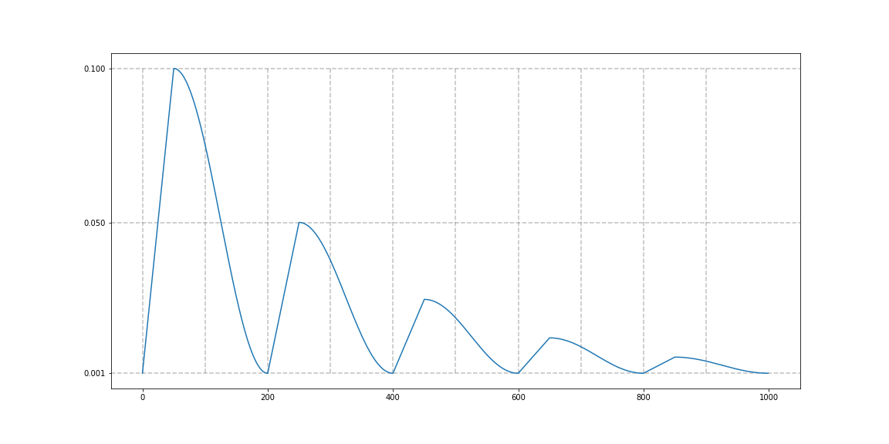

# Cosine Annealing with Warmup for PyTorch

## News
- 2020/12/22 : update is comming soon...
- 2020/12/24 : Merry Christmas! Release new version, 2.0. previous version is [here (branch: 1.0)](https://github.com/katsura-jp/pytorch-cosine-annealing-with-warmup/tree/1.0).
- 2021/06/04 : this package can be installed with pip.

## Installation
```bash
pip install 'git+https://github.com/katsura-jp/pytorch-cosine-annealing-with-warmup'
```

## Args
- optimizer (Optimizer): Wrapped optimizer.
- first_cycle_steps (int): First cycle step size.
- cycle_mult(float): Cycle steps magnification. Default: 1.
- max_lr(float): First cycle's max learning rate. Default: 0.1.
- min_lr(float): Min learning rate. Default: 0.001.
- warmup_steps(int): Linear warmup step size. Default: 0.
- gamma(float): Decrease rate of max learning rate by cycle. Default: 1.
- last_epoch (int): The index of last epoch. Default: -1.

## Example
```
>> from cosine_annealing_warmup import CosineAnnealingWarmupRestarts
>>
>> model = ...
>> optimizer = optim.SGD(model.parameters(), lr=0.1, momentum=0.9, weight_decay=1e-5) # lr is min lr
>> scheduler = CosineAnnealingWarmupRestarts(optimizer,
                                          first_cycle_steps=200,
                                          cycle_mult=1.0,
                                          max_lr=0.1,
                                          min_lr=0.001,
                                          warmup_steps=50,
                                          gamma=1.0)
>> for epoch in range(n_epoch):
>>     train()
>>     valid()
>>     scheduler.step()
```

- case1 : `CosineAnnealingWarmupRestarts(optimizer, first_cycle_steps=500, cycle_mult=1.0, max_lr=0.1, min_lr=0.001, warmup_steps=100, gamma=1.0)`

- case2 : `CosineAnnealingWarmupRestarts(optimizer, first_cycle_steps=200, cycle_mult=1.0, max_lr=0.1, min_lr=0.001, warmup_steps=50, gamma=0.5)`

