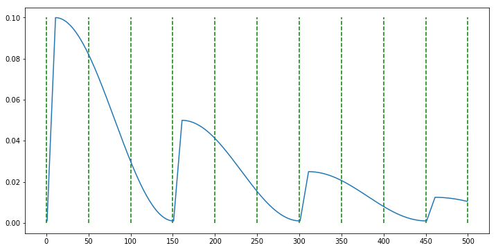
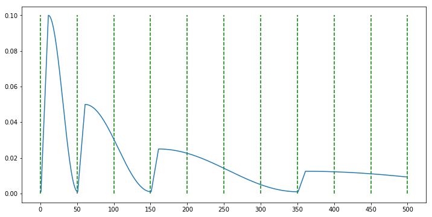
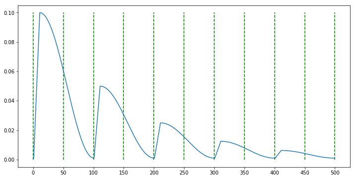
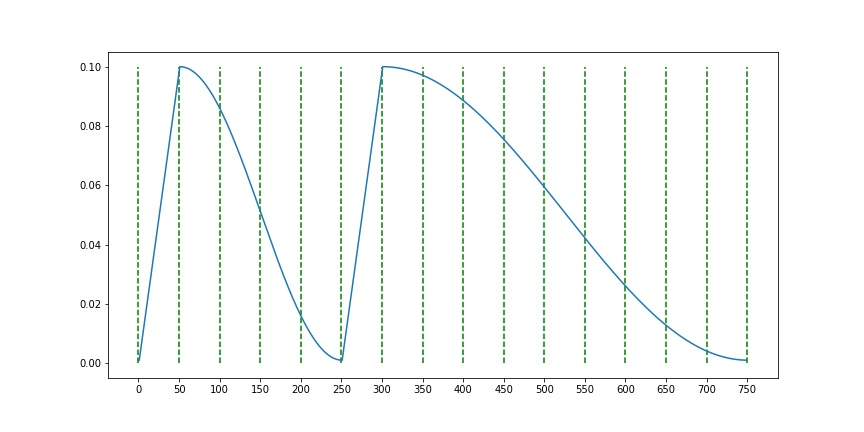

# Cosine Annealing with Warm up for PyTorch

2020/12/22 : update is comming soon...

## Example
```
>> model = ...
>> optimizer = optim.SGD(model.parameters(), lr=0.001, momentum=0.9, weight_decay=1e-5) # lr is min lr
>> scheduler = CosineAnnealingWarmUpRestarts(optimizer, T_0=250, T_mult=2, eta_max=0.1, T_up=50)
>> for epoch in range(n_epoch):
>>     train()
>>     valid()
>>     scheduler.step()
```

- case1 : `CosineAnnealingWarmUpRestarts(optimizer, T_0=150, T_mult=1, eta_max=0.1,  T_up=10, gamma=0.5)`

- case2 : `CosineAnnealingWarmUpRestarts(optimizer, T_0=50, T_mult=2, eta_max=0.1,  T_up=10, gamma=0.5)`

- case3 : `CosineAnnealingWarmUpRestarts(optimizer, T_0=100, T_mult=1, eta_max=0.1,  T_up=10, gamma=0.5)`

- case4 : `CosineAnnealingWarmUpRestarts(optimizer, T_0=250, T_mult=1, eta_max=0.1, T_up=50)`

- case5 : `CosineAnnealingWarmUpRestarts(optimizer, T_0=250, T_mult=2, eta_max=0.1, T_up=50)`



## 引数
- T_0 : Cosine Annearingのステップ数
- T_multi : ステップの倍率
- eta_max : lrの最大値
- T_up : warmupのイテレーション数 
- gamma : サイクル毎の最大学習率減少率
